

<a href="https://x.com/RicardoSawir"></a><a href="https://sawirstudio.com"></a><a href="https://github.com/sawirstudio"></a><a href="https://github.com/OCA/connector-shopify"></a>

<a href="https://github.com/OCA/connector-shopify"></a><a href="https://github.com/sawirricardo/openjek.com"></a>
<a href="https://github.com/sawirricardo/lazysvn"></a><a href="https://github.com/sawirricardo/remix-realworld"></a>
<a href="https://github.com/sawirricardo/laravel-whatsapp"></a><a href="https://github.com/sawirricardo/ehrcli"></a>
<!-- recent:start -->

<!-- recent:end -->

